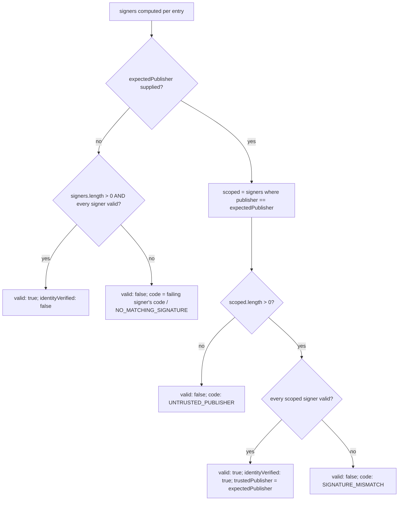
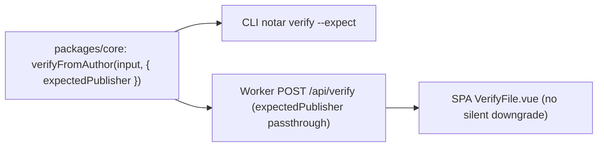

# fix: Bind Notar verification verdict to a trusted identity (VOC-3035 / VOC-3036)

## Summary

Two bug-bounty findings show that Notar's `valid: true` does not mean what users think it means.

- **VOC-3036 (F1)** — `verifyFromAuthor()` (the default path for the CLI, the web app's "From Publisher" mode, and the hosted Worker) returns `valid: true` if **any** signature entry verifies. The key-resolution domain (`publisher`) is read from the untrusted file itself, and the displayed `author` is a freeform, unauthenticated string. An attacker who controls any domain can produce arbitrary content that verifies as valid — including tampering with a genuine vendor document and appending their own co-signature, where the vendor's signature reports `SIGNATURE_MISMATCH` in the same response while the overall verdict stays `valid: true`.
- **VOC-3035 (F2)** — In the web SPA's "With Public Key" mode, when verification against the user's pinned key fails, `VerifyFile.vue` silently re-verifies in "From Publisher" mode (resolving a key from a domain named inside the untrusted file) and renders that second result as a green success, while the mode selector still reads "With Public Key". This defeats the one workflow whose trust anchor the attacker cannot influence.

Both findings were confirmed against the current source at `main` (`d205516`); F1's disjunction was reproduced live in this session.

This plan binds the verdict to an explicit, caller-chosen trusted identity, makes a present-but-failing signature fatal, presents the unauthenticated `author` honestly, and removes the SPA's silent trust-anchor downgrade.

---

## Problem Frame

Notar exists to answer one question: *"Did the publisher this file claims to come from actually sign it, unmodified?"* Today the default keyless path answers a weaker question — *"Did anyone, anywhere, sign these bytes?"* — and presents that weaker answer through every success surface: the CLI headline "Valid Signature", the CLI exit code `0`, the Worker JSON `valid` field, and the green badge in the web UI.

Three properties combine to make this exploitable (all in `packages/core/src/verify.ts`):

1. **The key-resolution domain is chosen by the document.** `verifySignatureEntry` resolves the public key from `entry.publisher`, a value taken directly from the artifact under test (`packages/core/src/verify.ts` ~line 611). There is no caller-supplied expected identity.
2. **The verdict is a disjunction.** `verifyMdFromAuthor` / `verifyZipFromAuthor` compute `const anyValid = signers.some((s) => s.valid)` and return `valid: true` on the first passing entry, regardless of how many others failed (`packages/core/src/verify.ts` ~lines 674-684 and ~719-726).
3. **The displayed identity is freeform and unauthenticated.** `docMeta` surfaces the front-matter `author` into `details.author` (`packages/core/src/verify.ts` ~lines 55-62); README documents `author` as "optional and accepts any string".

The SPA finding is a second, independent trigger of the same weakness: `canFallback()` in `packages/web/src/components/tabs/VerifyFile.vue` (~lines 156-160) unconditionally returns `"publisher"` when the user pinned a public key, routing a failed pinned-key check straight back into the vulnerable keyless path.

The explicit-key path — `verify(input, publicKey)` — is **not** affected: every entry is checked against the single caller-supplied key, so the disjunction is safe there. Scope is limited to keyless verification and its presentation.

---

## Requirements

- **R1** — Keyless verification MUST support an explicit caller-supplied expected publisher. When supplied, the verdict is `valid: true` only if a signature from that exact publisher validates.
- **R2** — A present-but-failing signature MUST NOT be masked by another passing signature. Without an expected publisher, the verdict is a conjunction: the document is valid only if it has at least one signature and every signature present verifies.
- **R3** — When an expected publisher is supplied, only that publisher's signatures decide the verdict; unrelated failing signers from other publishers do not block it, and a failing signature from the expected publisher is fatal.
- **R4** — The `author` field MUST be presented as claimed/unverified in every surface (library result shape, CLI, Worker JSON, web UI). It must never read as an authenticated identity.
- **R5** — The CLI MUST NOT print "Valid Signature" or exit `0` when the computed verdict is invalid, including the mixed case (some signer passed, another failed). Mixed results MUST be surfaced as a tampering warning.
- **R6** — The web SPA MUST NOT silently downgrade a user-pinned public key ("With Public Key") to publisher-resolved verification. A failed pinned-key check is shown as a failure. The effective trust anchor MUST be visible next to the verdict.
- **R7** — The published library API MUST remain source-compatible: existing call sites (`verifyFromAuthor(input)`, `verify(input, key)`) continue to compile and run. New capability is additive (optional option). The verdict *semantics* change is a documented behavior change shipped as a major version bump.
- **R8** — Regression tests MUST assert: (a) tampered doc + attacker co-signature is `valid: false`; (b) a forged single-signer doc from an unexpected publisher is `valid: false` when an expected publisher is supplied; (c) a pinned-key failure in the SPA never renders success.
- **R9** — User-facing documentation (README, SECURITY) MUST describe the new verdict semantics, the expected-publisher option, the `--expect` CLI flag, corrected exit-code behavior, and the unverified nature of `author`.

---

## Key Technical Decisions

**KTD1 — Add an optional `expectedPublisher` to `VerifyOptions` rather than a new required parameter.** Honors R7 (source compatibility): `verifyFromAuthor(input)` still compiles. `(session-settled: user-directed — chosen over a required-parameter clean-API redesign: keep existing call sites compiling while still closing the hole.)`

**KTD2 — Keyless verdict becomes conjunction when no expected publisher is given; identity-scoped when one is given.**
- No `expectedPublisher`: `valid = signers.length > 0 && signers.every(s => s.valid)`. A present-but-failing signature is fatal (R2). Existing single-signer callers are unaffected because a single valid signer still satisfies `every`.
- With `expectedPublisher`: let `scoped = signers.filter(s => s.publisher === expectedPublisher)`; `valid = scoped.length > 0 && scoped.every(s => s.valid)` (R1, R3). Unrelated failing signers do not block; a failing expected-publisher signature is fatal.

**KTD3 — Present `author` as claimed, not verified, without removing the field.** Keep `details.author` for compatibility, and add `details.identityVerified: boolean` (true only when an `expectedPublisher` was supplied and satisfied). UI/CLI label `author` as "claimed" and label the verified trust anchor separately as the validated signer's `publisher`. This closes R4 without a hard breaking rename. `(session-settled: user-directed — chosen over renaming author to displayName: keep the field, add an explicit verified/claimed distinction.)`

**KTD4 — Add one new error code `UNTRUSTED_PUBLISHER`** for "no valid signature from the expected publisher / no expected-publisher signer present". A failing expected-publisher signature keeps `SIGNATURE_MISMATCH`; a mixed conjunction failure surfaces the failing signer's own code with a top-level mixed-result reason.

**KTD5 — Remove only the `publicKey → publisher` branch of `canFallback()`.** The reverse (`publisher → publicKey`) strengthens the anchor and stays. Always render the effective trust anchor (mode + key/publisher used) next to the verdict (R6).

**KTD6 — Ship as `@binalyze/notar` 2.0.0.** The API signature stays additive, but `valid`'s meaning changes for previously-mis-verified documents; semver-major with a documented migration note is the honest classification (R7).

---

## High-Level Technical Design

New keyless verdict decision (applies in `verifyMdFromAuthor` and `verifyZipFromAuthor`, after per-signer results are computed):

Trust anchor across surfaces (unchanged data flow, corrected verdict + honest presentation):

The diagrams are authoritative for the verdict logic, not directional sketches.

---

## Implementation Units

### U1. Bind keyless verdict to identity in core

**Goal:** Add `expectedPublisher` support and the new conjunction / identity-scoped verdict semantics in the core library, plus the honest `author` distinction.

**Requirements:** R1, R2, R3, R4, R7 (source-compat), R8(a)(b)

**Dependencies:** none

**Files:**
- `packages/core/src/types.ts` — add `expectedPublisher?: string` to `VerifyOptions`; add `identityVerified?: boolean` and `trustedPublisher?: string` to `VerifyResult.details`; add `UNTRUSTED_PUBLISHER` to `VerifyErrorCode`.
- `packages/core/src/verify.ts` — implement KTD2 verdict in `verifyMdFromAuthor` and `verifyZipFromAuthor`; set `identityVerified` / `trustedPublisher` in the returned `details`.
- `packages/core/test/verify.spec.ts` — add regression coverage.

**Approach:**
1. Extend the three types in `types.ts` per KTD1/KTD3/KTD4.
2. In both `verifyMdFromAuthor` and `verifyZipFromAuthor`, after `signers` are computed, replace the `const anyValid = signers.some((s) => s.valid)` verdict with the KTD2 decision (see High-Level Technical Design). Keep the existing per-signer `verifySignatureEntry` logic untouched — only the aggregate verdict and returned `details` change.
3. For the ZIP path, the file-hash checks after the signature verdict still run only when the signature verdict passes (preserve current ordering).
4. Populate `details.identityVerified` (false unless an `expectedPublisher` was supplied and satisfied) and `details.trustedPublisher` (the validated expected publisher, else undefined).

**Patterns to follow:** existing verdict/return shape in `verifyMdFromAuthor` (`packages/core/src/verify.ts` ~lines 655-685) and `verifyFile` (~lines 110-121); error-code usage style in the same file.

**Test scenarios** (in `packages/core/test/verify.spec.ts`, following the `mockFetchWithKeys` pattern already in the file):
- Covers R2 / R8(a). Tampered doc + attacker co-signature (vendor signer `SIGNATURE_MISMATCH`, attacker signer valid), no `expectedPublisher` → `valid: false`; the vendor signer entry is present with `SIGNATURE_MISMATCH`.
- Covers R1 / R8(b). Forged single-signer doc from `attacker.example`, `expectedPublisher: "vendor.example"` → `valid: false`, `code: UNTRUSTED_PUBLISHER`.
- Covers R3. Doc with a valid `vendor.example` signer plus an unrelated failing `other.example` signer, `expectedPublisher: "vendor.example"` → `valid: true`, `identityVerified: true`, `trustedPublisher: "vendor.example"`.
- Covers R3. Doc where the `expectedPublisher` signer itself fails → `valid: false`, `code: SIGNATURE_MISMATCH`.
- Regression. Existing single valid signer, no `expectedPublisher` → still `valid: true`, `identityVerified: false` (guards R7 behavior for the common case).
- Edge. Conjunction with two valid signers, no `expectedPublisher` → `valid: true`.
- ZIP parity. Repeat the tamper+co-signature and expected-publisher-mismatch cases for `verifyZipFromAuthor` using `signPackage` + `mockFetchWithKeys`.

**Verification:** `cd packages/core && pnpm test` passes including new cases; `pnpm typecheck` clean; existing `verifyFromAuthor` suite still green.

---

### U2. Correct CLI verdict presentation and add `--expect`

**Goal:** The CLI never reports success for an invalid or mixed verdict, exposes `--expect`, presents `author` as claimed, and warns on mixed results.

**Requirements:** R4, R5, R7, R9 (flag surface)

**Dependencies:** U1

**Files:**
- `packages/core/src/cli/commands/verify.ts` — add `--expect` (aka `expected-publisher`) arg; pass it into `verifyFromAuthor`; fix `printResult` headline, mixed-result warning, `author` labeling; keep `process.exit(result.valid ? 0 : 1)` now that `valid` is correct.

**Approach:**
1. Add an `expect` string arg to the citty `args` and pass `{ expectedPublisher: args.expect }` to `verifyFromAuthor` when present (only in the keyless branch — the explicit `--public-key` branch is unchanged).
2. In `printResult`, drive the headline off `result.valid` (already does) — the fix is that `valid` is now correct, so no green headline on mixed. Additionally, when `result.details?.signers` contains both a passing and a failing entry, print an explicit mixed-result tampering warning line.
3. Label author output as claimed, e.g. `Author (claimed, unverified): <author>`, and when `details.trustedPublisher` is set, print `Verified publisher: <trustedPublisher>`.

**Patterns to follow:** existing `printResult` structure and `CODE_LABELS` map in `packages/core/src/cli/commands/verify.ts`; add an `UNTRUSTED_PUBLISHER` label to the map.

**Test scenarios:** the repo has no CLI-level test harness today. Add a focused unit test only if a `printResult`-style pure function can be extracted without over-refactoring; otherwise `Test expectation: none — CLI is a thin presentation wrapper over U1, whose verdict is covered by library tests`. Manually verify with the bounty's `evil.md` / `spoofed-signed.md` shapes: attack case exits `1`, honest baseline exits `0`.

**Verification:** `pnpm build:core` succeeds; manual run of `notar verify` on a tampered+co-signed file exits `1` with no "Valid Signature" line and a mixed-result warning; `notar verify --expect vendor.example` on a forged doc exits `1`.

---

### U3. Thread `expectedPublisher` through the Worker

**Goal:** The `/api/verify` endpoint accepts and forwards an optional `expectedPublisher`, and returns the corrected verdict.

**Requirements:** R1, R6 (server support for the SPA), R8

**Dependencies:** U1

**Files:**
- `packages/web/worker.ts` — read optional `expectedPublisher` from the JSON body; pass it into `verifyFromAuthor(input, { ..., expectedPublisher })`.
- `packages/web/test/server.spec.ts` — add coverage.

**Approach:**
1. Extend the request body type in the `/verify` handler with `expectedPublisher?: string`.
2. In the `fromAuthor` branch, include `expectedPublisher` in the options object passed to `verifyFromAuthor` (alongside the existing `fetch`).
3. Leave the explicit `publicKey` branch untouched.

**Patterns to follow:** existing body destructuring and the `fromAuthor` branch in `packages/web/worker.ts` (~lines 33-61); test style in `packages/web/test/server.spec.ts`.

**Test scenarios** (in `packages/web/test/server.spec.ts`):
- Covers R2. `POST /api/verify` with `fromAuthor: true` for a tampered+co-signed doc → response `valid: false`.
- Covers R1. `POST /api/verify` with `fromAuthor: true` + `expectedPublisher` naming a publisher not present → `valid: false`, `code: UNTRUSTED_PUBLISHER`.
- Regression. Existing valid single-signer sample still returns `valid: true`.

**Verification:** `cd packages/web && pnpm test` passes (the dev/preview server specs need local port + Wrangler log access — run in an unsandboxed shell).

---

### U4. Remove the SPA silent trust-anchor downgrade (F2)

**Goal:** A failed "With Public Key" verification is shown as a failure; no silent re-verification via publisher. The effective trust anchor is visible.

**Requirements:** R6, R8(c)

**Dependencies:** none (independent of U1; can land in parallel)

**Files:**
- `packages/web/src/components/tabs/VerifyFile.vue` — remove the `publicKey → publisher` branch of `canFallback()`; render the effective trust anchor next to the result.

**Approach:**
1. In `canFallback()` (~lines 156-160), delete `if (mode.value === "publicKey") return "publisher";`. Keep the `publisher → publicKey` branch (it strengthens the anchor).
2. In the verify flow (~lines 184-198), when the pinned-key `primary` result is invalid and no valid strengthening fallback applies, render `primary.data` (the failure) — never a publisher-resolved success while the mode reads "With Public Key".
3. Add a small, always-visible line near the result stating the effective anchor: "Verified against: your pasted public key" vs "Verified against: publisher-resolved key (`<publisher>`)".

**Patterns to follow:** existing `mode`, `canFallback`, and result-rendering logic in `VerifyFile.vue`; `ResultBadge` prop usage.

**Test scenarios:** browser-driven test infra is not part of the repo's standing suite (the bounty PoC used external Playwright). Add a component-level test only if the existing harness supports mounting `VerifyFile.vue`; otherwise `Test expectation: none — behavior guarded by manual reproduction of the bounty PoC (pinned-key failure must not render green)`. Manual check: pin a non-matching key to a signed sample → result shows failure, mode still reads "With Public Key", effective-anchor line reads the pasted key.

**Verification:** manual reproduction of VOC-3035 no longer shows a green badge; `cd packages/web && pnpm typecheck` clean; `pnpm lint` clean.

---

### U5. Present author as unverified and expose expected-publisher in the UI

**Goal:** The web UI never presents the unauthenticated `author` as verified identity, shows the verified publisher when present, and lets the user optionally pin an expected publisher in "From Publisher" mode.

**Requirements:** R4, R1 (UI surface)

**Dependencies:** U3, U4

**Files:**
- `packages/web/src/components/ui/ResultBadge.vue` — label `author` as claimed/unverified; when `details.trustedPublisher` is set, show it as the verified anchor.
- `packages/web/src/components/ui/SignerDetail.vue` — ensure per-signer publisher/validity framing stays honest (no change to logic if already per-signer; adjust labels if needed).
- `packages/web/src/components/tabs/VerifyFile.vue` — optional input to supply `expectedPublisher` for the "From Publisher" mode, forwarded to `/api/verify`.

**Approach:**
1. In `ResultBadge.vue`, change the Document "Author" row label to convey it is claimed and unverified; add a "Verified publisher" row bound to `details.trustedPublisher` when present.
2. In `VerifyFile.vue`, add an optional expected-publisher text input in "From Publisher" mode; include it in the `/api/verify` body when non-empty.
3. Keep `signaturesValid` = `signers.every(s => s.valid)` (already correct) so mixed results render amber, consistent with the new core verdict.

**Patterns to follow:** existing Document metadata grid and `signaturesLabel`/`signaturesColor` computeds in `ResultBadge.vue`; input styling in `VerifyFile.vue` step sections.

**Test scenarios:** same harness caveat as U4 — prefer manual verification. Manual checks: a forged doc with `author: "Binalyze (notar.binalyze.ai)"` shows Author labeled claimed/unverified and no green identity claim; supplying an expected publisher that isn't present yields a failure state.

**Verification:** manual UI review at desktop and mobile widths; `pnpm typecheck` and `pnpm lint` clean for `packages/web`.

---

### U6. Documentation and major version bump

**Goal:** Document the new semantics and ship the behavior change as a major version.

**Requirements:** R7, R9

**Dependencies:** U1, U2 (final API/flag shape must be settled)

**Files:**
- `README.md` — update "Signing Formats"/verification sections: `author` is unverified; keyless verdict is conjunction; `expectedPublisher` option; `--expect` flag; corrected exit-code semantics; multi-signer verdict rule.
- `packages/core/package.json` — bump `version` to `2.0.0`.
- `SECURITY.md` — note the fixed advisories (VOC-3035 / VOC-3036) and that upgrading to 2.0.0 is required.
- `CLAUDE.md` — only if a documented command or behavior it describes changed.

**Approach:** Prose + version edits only; no code. Keep README examples consistent with the final `--expect` flag name chosen in U2.

**Patterns to follow:** existing README section structure and tone; existing `SECURITY.md` format.

**Test scenarios:** `Test expectation: none — documentation and version metadata only.`

**Verification:** `pnpm --filter @binalyze/notar publish:core:dry` (or `release:dry`) validates the package with the new version; README examples match implemented flags.

---

## Verification Contract

- `cd packages/core && pnpm test` — all core tests pass, including the new U1 regression cases (tamper+co-sign fatal; expected-publisher mismatch fatal; identity-scoped success).
- `cd packages/web && pnpm test` — Worker specs pass, including U3 cases (run unsandboxed: needs local port + Wrangler log write access).
- `pnpm typecheck` — clean across the monorepo.
- `pnpm lint` — clean.
- `pnpm build` — all packages build.
- Manual VOC-3035: pinned non-matching key never renders a green badge; mode selector and effective-anchor line stay consistent.
- Manual VOC-3036: `notar verify` on a tampered+co-signed file exits `1` with a mixed-result warning; `--expect <vendor>` on a forged doc exits `1`.

## Definition of Done

- R1-R9 satisfied and traced to units U1-U6.
- New regression tests assert VOC-3035 and VOC-3036 cannot recur (R8).
- `@binalyze/notar` version is `2.0.0`; existing call sites still compile (R7).
- README and SECURITY document the new semantics (R9).
- Full `pnpm test`, `pnpm typecheck`, `pnpm lint`, `pnpm build` green.

---

## Scope Boundaries

**In scope:** keyless verification verdict semantics and their presentation across core library, CLI, Worker, and web SPA; the SPA fallback fix; docs + version bump.

**Out of scope (non-goals):**
- The explicit-key path `verify(input, publicKey)` — already safe, unchanged.
- Signing behavior (`sign`, `signFile`, `signPackage`) and the signature de-duplication rule.
- Key discovery mechanics (HTTPS `.well-known`, DNS TXT, revocation/expiry) — unchanged.

### Deferred to Follow-Up Work
- A structured non-boolean verify result (e.g. `validSigners: string[]`) as a richer future API — the current fix keeps the boolean with an added `identityVerified` flag.
- Browser end-to-end test harness (Playwright) in the standing suite to automate the VOC-3035 UI regression; today it is covered by manual reproduction.
- Binding `author` to `publisher` at signing time (require `author === publisher` for a signature to count) — a larger product decision; this plan makes `author` honest at verification time instead.

---

## Open Questions

- Final CLI flag name: `--expect` vs `--expected-publisher` (U2 picks one; README in U6 must match).
- Whether the SPA should expose the expected-publisher input in "From Publisher" mode now (U5) or defer it — the security fix (U1-U4) does not depend on it; it is a usability improvement on top.

---

## Sources & Research

- Bug bounty report VOC-3036 (F1) — verification verdict not bound to a trusted identity.
- Bug bounty report VOC-3035 (F2) — SPA silently discards the user's chosen public key.
- Live reproduction of F1 in this session against `packages/core/src/verify.ts` at `main` (`d205516`): tampered doc + attacker co-signature returned `valid: true` while the vendor signer reported `SIGNATURE_MISMATCH`.
- Code read: `packages/core/src/verify.ts`, `packages/core/src/sign.ts`, `packages/core/src/cli/commands/verify.ts`, `packages/core/src/types.ts`, `packages/web/worker.ts`, `packages/web/helpers.ts`, `packages/web/src/components/tabs/VerifyFile.vue`, `packages/web/src/components/ui/ResultBadge.vue`, `packages/web/src/components/ui/SignerDetail.vue`, `packages/core/test/verify.spec.ts`.
