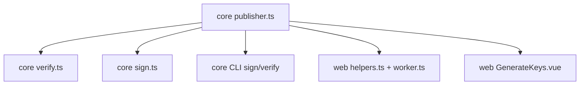

# Publisher Host Validation - Plan

## Goal Capsule

- **Objective:** Close bounty #1732 and its whole bug class. Every attacker-controlled field from a signed artifact that reaches a network request or a trust decision passes one shared validator first.
- **Authority:** This plan > `CLAUDE.md` rules > prior plan `docs/plans/2026-08-04-001-fix-notar-verification-trust-binding-plan.md`. The prior plan's verdict semantics (conjunction, `expectedPublisher`, `identityVerified`) stay unchanged.
- **Stop conditions:** Stop and ask if a change would alter the signed payload bytes (`scopePayload` / `buildSignablePayload`), or break verification of existing, well-formed signed documents.
- **Execution profile:** Core library first (test-first for the validator), then sign/verify integration, then Worker/UI, then docs and prevention.
- **Tail:** Branch `fix/publisher-host-validation`. Bump `@binalyze/notar` to 2.0.1; npm publish is deferred (see Deferred to Follow-Up Work).

---

## Product Contract

### Summary

Add a single `publisher` host validator in `packages/core`. Build the key-discovery URL and DNS name only from its canonical output. Reject malformed publishers at sign time and at verify time. Allow plaintext HTTP only for exact `localhost` / `127.0.0.1` and only when the caller opts in. Report the real transport in `keySource`.

### Problem Frame

`packages/core/src/verify.ts` `keysUrl()` concatenates `entry.publisher`, read from the file under test, into the URL authority. `isLocal()` picks HTTP with `startsWith("localhost")` on the raw string. `packages/web/helpers.ts` `assetFetch()` then routes on `new URL(url).hostname`, a different value. `localhost@attacker.test:5125` therefore selects HTTP and is fetched from `attacker.test`. `keySource` is hardcoded to `"https"`, so the UI claims HTTPS. The same logic is copied in `packages/core/src/sign.ts` and `packages/web/helpers.ts` / `worker.ts` (`/api/lookup`). `fetchPublicKeyFromDns` builds `notar.${keyId}.${author}` from two unvalidated fields.

**Root cause history.** The pattern exists since the initial commit (`355f8fb`). The prior bounty fix (`d0aea70`, PR #5) named the root cause in its own commit message — "the key-resolution domain taken from the untrusted file" — but fixed only the verdict layer. It treated `publisher` as an identity to compare, not as attacker input that selects a network destination and transport. The previous plan had no requirement covering input validation of file fields. This plan closes that gap and adds process guards so the next fix covers the whole class.

### Requirements

**Validation core**

- R1. A single exported core helper validates and canonicalizes a publisher. It rejects non-string input, any character outside printable ASCII, labels starting with `xn--`, userinfo (`@`), path, query, fragment, backslash, percent-encoding, whitespace, control characters, empty labels, trailing dot, IP literals (except exact `127.0.0.1`), IDN/Unicode input, and any value the WHATWG URL parser would rewrite other than ASCII lowercasing (case is canonicalized per KTD4).
- R2. A port is accepted only for local hosts (`localhost`, `127.0.0.1`). Public hosts reject any port.
- R3. `keyId` values used in DNS names are validated as a single DNS label. Non-string `keyId`, `publisher`, or `value` in a signature entry fail that signer without throwing.

**Key discovery**

- R4. Key-discovery URLs and DNS FQDNs are built only from validated, canonical parts, never from the raw string.
- R5. Plaintext HTTP is used only for exact local hosts and only when the caller sets an explicit opt-in. Without the opt-in, local publishers fail with a clear error.
- R6. `keySource` reports the actual transport (`https`, `http`, or `dns`).

**Sign and verify behavior**

- R7. `validateSigningKey` rejects an invalid publisher before any fetch. `signFile`, `signPackage`, and `sign` still sign a non-host publisher (pinned-key workflow) but the result can only verify via pinned key; keyless verification rejects it (R8). Pinned-key `verify(input, publicKey)` does not validate `publisher`.
- R8. Keyless verification marks a signer with an invalid publisher as failed with a new `INVALID_PUBLISHER` code and performs no network request for it.
- R9. `expectedPublisher` is validated. Invalid values fail with `INVALID_PUBLISHER`. Comparison with signer publishers uses the canonical form.
- R10. The signed payload keeps the raw `publisher` string exactly as stored. Existing well-formed signatures stay valid.

**Web surface**

- R11. The Worker (`/api/verify`, `/api/lookup`) and SPA use the core helper; no local copy of host logic remains. HTTP opt-in follows R18.
- R12. The UI shows the actual transport and marks HTTP as insecure.

**Fetch and output hardening**

- R15. Every key-discovery HTTP fetch goes through one core helper that disables redirect following (`redirect: "error"`) and treats any 3xx as `KEY_FETCH_FAILED`. The helper applies a 5 s timeout, a 64 KiB body cap, and schema validation of the manifest; any violation fails that signer without throwing.
- R16. Keyless verification rejects files with more than 16 signature entries before any network I/O. With `expectedPublisher`, only signers whose canonical publisher matches are resolved; others are reported as not evaluated.
- R17. File-derived strings (publisher, keyId, author, name, description, version, ZIP paths, reasons) are escaped before display in the CLI and the SPA text export. C0/C1 control and Unicode bidi/format characters render as visible escapes.
- R18. The Worker enables the HTTP opt-in only when `ALLOW_INSECURE_LOCALHOST === "true"` and the request host is itself `localhost` or `127.0.0.1`. Any other configuration fails closed.

**Regression and prevention**

- R13. Regression tests cover every payload named in the bounty report plus numeric loopback and Unicode forms, and prove no fetch is issued for rejected publishers.
- R14. The team records the lesson and adds guards (threat-model note, PR checklist, CLAUDE.md rule) so file-derived fields are always treated as attacker input.
- R19. A permanent test fails the build if host, URL, DNS-name construction, `startsWith("localhost"`, or a bare key-discovery `fetch(` appears outside `packages/core/src/publisher.ts`.

### Scope Boundaries

- Out: Verdict semantics from the prior plan (conjunction, identity scoping) — unchanged.
- Out: Rate limiting or authentication for `/api/verify` and `/api/lookup`.
- Out: Backport to 1.x.

### Deferred to Follow-Up Work

- Publishing 2.0.1 to npm (blocked on `NPM_TOKEN`, separate operational task).

---

## Planning Contract

### Key Technical Decisions

- KTD1. **New module `packages/core/src/publisher.ts` owns all host logic.** `verify.ts`, `sign.ts`, and the web package import from it. Duplication was the enabler of this bug. (session-settled: user-approved — chosen over per-file patches: one owner prevents drift between consumers.)
- KTD2. **Reject, do not silently normalize.** An invalid publisher fails sign and verify. Silent normalization would keep two representations alive. Rejection happens at discovery time (keyless verify, `validateSigningKey`, Worker endpoints), not at pinned-key sign/verify (R7). (session-settled: user-approved — chosen over normalize-and-continue: normalization keeps the attack surface.)
- KTD3. **"Parser round-trip" rule.** Step 0: reject non-strings and any input not matching printable ASCII `^[\x21-\x7E]+$` (closes U+212A Kelvin → `k` and similar case-fold tricks). The LDH regex runs on the lowercased raw input. Labels starting with `xn--` are rejected. Validation then parses `https://<input>/` with the WHATWG `URL`. The value is accepted only if the parsed `host` equals the lowercased input and `username`, `password`, `pathname !== "/"`, `search`, `hash` are empty. This single check rejects numeric loopback (`2130706433`, `0x7f.1`, `127.1`), Unicode dots (`。`), IDN, percent-encoding, and userinfo, because the parser rewrites or splits them. A strict LDH label regex (`[a-z0-9-]`, 1–63 chars, no leading/trailing hyphen, total ≤ 253, at least one dot, non-numeric TLD) runs in addition. Exact `localhost` and `127.0.0.1` bypass the LDH regex; all other hosts must pass it. After the round-trip, a port is accepted only when the host is local and the port is an integer 1–65535; any port on a public host is rejected.
- KTD4. **Case is canonicalized, not rejected.** `Example.COM` is valid and canonical `example.com`. The raw string still feeds the signed payload (R10). Only fetch and comparison use the canonical form. This keeps existing mixed-case signatures valid.
- KTD5. **HTTP opt-in is `allowInsecureLocalhost?: boolean`** on `VerifyOptions` and `ValidateSigningKeyOptions`, default `false`. The CLI exposes `--allow-insecure-localhost`. The Worker sets it per R18. (session-settled: user-approved — chosen over automatic HTTP for exact localhost: production code never picks HTTP implicitly.)
- KTD6. **Ports only for local hosts.** Preserves the existing `localhost:5000` / `localhost:5123` dev flows. (session-settled: user-approved — chosen over rejecting all ports.)
- KTD7. **One new error code `INVALID_PUBLISHER`.** Used for malformed publishers, a local publisher without opt-in, and an invalid `expectedPublisher`. `reason` carries the specific rule that failed. `keySource` type widens to `"https" | "http" | "dns"`.
- KTD8. **`assetFetch` routes by exact canonical host and only when the R18 opt-in is active.** Otherwise local publishers are already rejected by core, so the Worker never serves its own asset manifest for a file-supplied `localhost`. `BUILD_MODE` is not a security switch because the default wrangler env is `development`.
- KTD10. **One `fetchKeyManifest` helper in `publisher.ts`** builds the URL, calls `fetchFn(url, { redirect: "error" })`, rejects 3xx and a `response.url` that differs from the built URL, and returns the transport used. All five manifest fetch sites use it (R15).
- KTD11. **One `dnsName` builder in `publisher.ts`** returns `notar.<keyId>.<host>` from a validated keyId and a public host; core DNS and web `checkDnsKey` both use it.
- KTD12. **One `displaySafe` helper in core** escapes untrusted strings for terminal and text export (R17).
- KTD13. **Signer cap of 16** chosen as far above any real multi-signer document; exceeding it returns new code `TOO_MANY_SIGNATURES` (R16).
- KTD9. **Release as 2.0.1.** Rejection only affects values with no legitimate use. (session-settled: user-approved — chosen over 2.1.0.)

### High-Level Technical Design

```mermaid
flowchart TB
  A[raw publisher from file / opts / expectedPublisher] --> B[publisher.ts: parsePublisher]
  B -->|invalid| X[INVALID_PUBLISHER, no fetch]
  B -->|valid| C{local host?}
  C -- no --> D[https://canonicalHost/.well-known/notar-keys.json]
  C -- yes --> E{allowInsecureLocalhost?}
  E -- no --> X
  E -- yes --> F[http://canonicalHost:port/.well-known/notar-keys.json]
  D --> G[fetchKeyManifest redirect:error; keySource=https]
  F --> H[fetchKeyManifest redirect:error; keySource=http]
  C -- no -->|valid keyId, HTTPS failed| I[notar.keyId.host DNS fallback; keySource=dns]
```

Consumers after the change:



### Assumptions

- No production-signed document uses a publisher with userinfo, path, port on a public host, IP literal, or trailing dot.
- `URL` parsing behavior is identical in Node 20+ and the Workers runtime (both WHATWG).

---

## Implementation Units

### U1. Shared publisher validator

- **Goal:** Create the single owner of publisher/keyId validation, URL and DNS-name construction, manifest fetch, and display escaping (KTD1, KTD3, KTD10, KTD11, KTD12).
- **Requirements:** R1, R2, R3, R13, R15, R17
- **Dependencies:** none
- **Files:** `packages/core/src/publisher.ts` (new), `packages/core/src/types.ts`, `packages/core/src/index.ts`, `packages/core/test/publisher.spec.ts` (new)
- **Approach:**
  1. Export a parse function returning `{ host, port?, local, canonical }` or a typed failure with a reason. `host` excludes the port; `canonical` is `host[:port]`.
  2. Export a keys-URL builder that takes the parsed value and `allowInsecureLocalhost` (KTD5), an `isValidKeyId` check (DNS label rules), and a `dnsName` builder (KTD11) that refuses local hosts.
  3. Export `fetchKeyManifest` (KTD10) returning the parsed manifest and the transport used.
  4. Export `displaySafe` (KTD12).
  5. Add `INVALID_PUBLISHER` and `TOO_MANY_SIGNATURES` to `VerifyErrorCode`, `allowInsecureLocalhost` to both option types, and widen `keySource` (KTD7).
- **Execution note:** Write the rejection matrix test first.
- **Test scenarios:**
  - Accepts `example.com`, `sub.example.co.uk`, `Example.COM` (canonical `example.com`), `localhost`, `localhost:5123`, `127.0.0.1:5000`.
  - Rejects userinfo: `localhost@attacker.test:5125`, `user:pw@example.com`, `example.com@evil.com`.
  - Prefix tricks are never local: `localhost.evil.com` and `127.0.0.1.nip.io` parse as public hosts (`local: false`, HTTPS only).
  - Rejects path/query/fragment: `example.com/x`, `example.com?x`, `example.com#x`, `example.com\\evil.com`.
  - Rejects encoded delimiters: `example.com%2fx`, `localhost%40evil.com`.
  - Rejects public host with port: `example.com:443`, `example.com:8080`.
  - Rejects invalid ports on local: `localhost:0`, `localhost:99999`, `localhost:abc`.
  - Rejects trailing dot, empty labels, leading hyphen, label > 63, total > 253, single-label non-local (`intranet`).
  - Rejects numeric/alternate loopback: `2130706433`, `0x7f.1`, `127.1`, `0177.0.0.1`, `[::1]`, `127.0.0.2`.
  - Rejects Unicode: `localhost。evil.com`, `exаmple.com` (Cyrillic a), full-width chars, `\u212Aey.com` (Kelvin sign case-folds to `k`).
  - Rejects punycode A-labels: `xn--exmple-4nf.com`.
  - Rejects non-string input: `["example.com"]`, `123`, `null`, `{}` — typed failure, no throw.
  - Rejects whitespace and control chars: ` example.com`, `example.com\n`, `\u0000`.
  - Keys URL: public host → `https://…`; local with opt-in → `http://…`; local without opt-in → failure.
  - `isValidKeyId`: accepts `key_ba1094403d05`; rejects `a.b`, empty, 64+ chars, `x/y`, non-string.
  - `dnsName`: `notar.key_x.example.com` for public host; refuses local host and invalid keyId.
  - `fetchKeyManifest`: passes `redirect: "error"`; a mock 302 response → `KEY_FETCH_FAILED`, exactly one fetch call; `response.url` differing from the built URL → failure; HTTP path reports `http`.
  - `fetchKeyManifest` limits: a hanging mock → `NETWORK_ERROR` after timeout; a 65 KiB body → `KEY_FETCH_FAILED`; manifest with non-string `publicKey` or wrong-length key → signer failure, no throw.
  - `displaySafe`: `\r`, `\x1b[1A`, `\u202E`, `\u0000` render as visible escapes; plain ASCII unchanged.
- **Verification:** `publisher.spec.ts` passes; helper exported from `@binalyze/notar`.

### U2. Verify integration

- **Goal:** All key resolution in `verify.ts` goes through U1 and reports the real transport.
- **Requirements:** R3, R4, R5, R6, R8, R9, R10, R13, R15, R16
- **Dependencies:** U1
- **Files:** `packages/core/src/verify.ts`, `packages/core/test/verify.spec.ts`, `packages/core/test/dns.spec.ts`
- **Approach:**
  1. Delete local `isLocal` / `keysUrl`. `fetchPublicKeys`, `fetchPublicKey`, and `resolvePublicKeyFromHttps` use `fetchKeyManifest` (R15).
  2. In `verifySignatureEntry`, parse `entry.publisher` first. On failure return `INVALID_PUBLISHER` without fetch (R8). Keep the raw string in `scopePayload` (R10).
  3. `fetchPublicKeyFromDns` uses the U1 `dnsName` builder (R3, R4). DNS fallback is skipped for local publishers. Non-string entry fields fail the signer without throwing (R3).
  4. Validate `expectedPublisher` once in `verifyFromAuthor`; compare canonical forms in `computeKeylessVerdict` (R9).
  5. Set `keySource` to `http` when the HTTP path was used (R6).
  6. Before any network I/O, reject more than 16 signature entries with `TOO_MANY_SIGNATURES`. With `expectedPublisher`, resolve keys only for matching signers (R16, KTD13).
- **Patterns to follow:** existing `mockFetchWithKeys` in `verify.spec.ts`; existing `ResolvedKey` shape.
- **Test scenarios:**
  - Bounty PoC: doc signed with publisher `localhost@attacker.test:5125` → signer `INVALID_PUBLISHER`, `valid: false`, mock fetch never called.
  - `localhost.evil.com` publisher → fetch URL is `https://localhost.evil.com/...`.
  - `localhost:5123` publisher, no opt-in → `INVALID_PUBLISHER`, no fetch.
  - `localhost:5123` publisher, `allowInsecureLocalhost: true` → fetch `http://localhost:5123/...`, `keySource: "http"`.
  - Public host → `keySource: "https"` (existing tests keep passing).
  - DNS fallback with keyId `a.evil` → no DNS query issued, signer fails.
  - `expectedPublisher: "Example.com"` matches signer `example.com` → `identityVerified: true`.
  - `expectedPublisher: "localhost@evil.com"` → `valid: false`, `INVALID_PUBLISHER`.
  - Mixed-case publisher `Example.COM` signed before the change still verifies (R10).
  - ZIP parity: repeat PoC and expected-publisher cases through `verifyPackage` / zip `verifyFromAuthor`.
  - Multi-signer: one valid signer + one invalid-publisher signer, no `expectedPublisher` → `valid: false` (conjunction preserved).
  - Redirect: mock returns 302 to `http://127.0.0.1/` for a valid public publisher → signer fails, fetch called once, no follow.
  - 17 signature entries → `TOO_MANY_SIGNATURES`, fetch never called.
  - `expectedPublisher: "a.com"` with signers `a.com` and `b.com` → only `a.com` manifest fetched.
  - ZIP manifest with `publisher` as array / number / null → per-signer failure, no throw, no fetch.
  - `localhost:5000` publisher with opt-in and HTTP failure → no DoH query issued.
- **Verification:** all core tests pass; no raw string reaches a URL or FQDN (grep for template literals with `publisher`/`author` in URLs returns only U1).

### U3. Sign and CLI integration

- **Goal:** Signing pre-flight uses the shared helper; CLI exposes the opt-in and escapes output.
- **Requirements:** R5, R7, R15, R17
- **Dependencies:** U1
- **Files:** `packages/core/src/sign.ts`, `packages/core/src/cli/commands/sign.ts`, `packages/core/src/cli/commands/verify.ts`, `packages/core/src/cli/index.ts`, `packages/core/test/sign.spec.ts`
- **Approach:**
  1. Delete `isLocal` / `keysUrl` in `sign.ts`; `validateSigningKey` uses U1 parse and `fetchKeyManifest`.
  2. `signFile` / `signPackage` keep signing non-host publishers (R7). The CLI `sign` command warns when the publisher is not a valid host (keyless verification will reject it).
  3. Add `--allow-insecure-localhost` to CLI `verify` only (CLI `sign` does no key fetch). Map `INVALID_PUBLISHER` and `TOO_MANY_SIGNATURES` in `CODE_LABELS`.
  4. CLI `printResult` passes every file-derived string through `displaySafe` (R17).
- **Test scenarios:**
  - `signFile` without publisher and `author: "Jane Doe"` succeeds; the result verifies with the pinned key via `verify()` and fails keyless with `INVALID_PUBLISHER`.
  - `signFile` with `Example.com` succeeds and stores the raw string.
  - CLI verify output for a publisher containing `\r` and `\x1b` prints escaped text.
  - `validateSigningKey("localhost:5000")` without opt-in throws; with opt-in fetches `http://localhost:5000/...`.
  - `validateSigningKey("example.com")` fetches `https://example.com/...`.
- **Verification:** sign tests pass; `notar verify --help` lists the new flag; `notar sign --help` does not.

### U4. Worker and SPA

- **Goal:** Web uses the core helpers, enables HTTP only under the fail-closed R18 gate, and shows real transport.
- **Requirements:** R11, R12, R13, R17, R18
- **Dependencies:** U2
- **Files:** `packages/web/helpers.ts`, `packages/web/worker.ts`, `packages/web/src/components/ui/SignerDetail.vue`, `packages/web/src/components/ui/ResultBadge.vue`, `packages/web/src/components/tabs/GenerateKeys.vue`, `packages/web/test/server.spec.ts`
- **Approach:**
  1. Remove `isLocalhost`. Compute `insecureLocal` once per request per R18. `assetFetch` routes to `ASSETS` only when `insecureLocal` and the parsed URL host is exactly local (KTD8).
  2. `/api/verify` and `/api/lookup` pass `allowInsecureLocalhost: insecureLocal`. `/api/lookup` validates `domain` and `keyId` with U1 and returns 400 on failure. `checkHttpsKey` builds its message URL with the U1 builder. `checkDnsKey` uses the U1 `dnsName` builder (KTD11).
  3. Add `ALLOW_INSECURE_LOCALHOST` only to the local dev config (`.env.dev` / `wrangler dev`), never to top-level or `prod` vars in `packages/web/wrangler.jsonc`.
  4. `SignerDetail.vue` renders `http` as "HTTP (.well-known) — insecure, dev only" with a warning style. `ResultBadge.vue` text export includes it and uses `displaySafe`.
  5. `GenerateKeys.vue` domain check uses the exported core validator.
- **Test scenarios:**
  - `POST /api/verify` with the bounty PoC file → signer `INVALID_PUBLISHER`, no outbound request.
  - `POST /api/lookup` with `domain: "localhost@evil.com"` → 400.
  - With `ALLOW_INSECURE_LOCALHOST=true` and a localhost request host: `localhost:5000` sample doc still verifies, `keySource: "http"`; `POST /api/lookup` with `localhost:5000` finds the sample key.
  - `BUILD_MODE=development` without `ALLOW_INSECURE_LOCALHOST` → `localhost:5000` doc fails with `INVALID_PUBLISHER`.
  - `ALLOW_INSECURE_LOCALHOST=true` but non-local request host → local publisher rejected.
  - `POST /api/verify` with `expectedPublisher: "evil.com/x"` → `INVALID_PUBLISHER`.
- **Verification:** `packages/web` tests and typecheck pass; manual SPA check shows the HTTP warning for the local sample.

### U5. Prevention and docs

- **Goal:** Record the lesson and add guards so the class does not return (R14).
- **Requirements:** R14, R19
- **Dependencies:** U2, U3, U4
- **Files:** `packages/core/test/class-sweep.spec.ts` (new), `docs/solutions/2026-09-30-untrusted-publisher-url-authority.md` (new), `SECURITY.md`, `packages/core/README.md`, `CLAUDE.md`, `.github/pull_request_template.md` (new), `packages/core/package.json` (version 2.0.1)
- **Approach:**
  1. Solution note: root cause, why PR #5 missed it (verdict-only fix), and the rule "every field read from a signed artifact is attacker input; validate before network, filesystem, or trust use."
  2. `SECURITY.md` and `packages/core/README.md`: document publisher format rules, HTTP opt-in (`allowInsecureLocalhost` / `--allow-insecure-localhost`), `INVALID_PUBLISHER`, `keySource: http`.
  3. `CLAUDE.md` Rules: add "Never build URLs/hostnames/DNS names from file-derived fields; use `packages/core/src/publisher.ts`. Never duplicate host logic."
  4. PR template security checklist: untrusted inputs listed, sibling code paths searched for the same pattern, negative tests added.
  5. Bump core to 2.0.1 via `pnpm version:core patch`.
  6. `class-sweep.spec.ts` (R19) scans `packages/core/src` and `packages/web` sources (excluding `publisher.ts`, tests, `node_modules`, `dist`) for `startsWith("localhost"`, `isLocal`, `keysUrl`, template literals building `http://`, `https://`, or `notar.` from `publisher`/`author`/`domain`/`keyId`, and `fetch(` calls on key-discovery URLs. The solution note lists every file-derived field explicitly.
- **Test scenarios:**
  - Current tree after U1–U4 → sweep passes.
  - A fixture string containing `` `https://${publisher}/` `` is detected by the sweep matcher.
- **Verification:** sweep test passes in `pnpm test`; files present; README/SECURITY describe new behavior accurately.

---

## Verification Contract

| Gate | Command | Applies to |
|---|---|---|
| Typecheck | `pnpm typecheck` | all units |
| Lint | `pnpm lint` | all units |
| Core tests | `cd packages/core && pnpm test` | U1, U2, U3 |
| Web tests | `cd packages/web && pnpm test` | U4 |
| Class sweep | `packages/core/test/class-sweep.spec.ts` (R19) passes | U2, U3, U4, U5 |
| PoC replay | Bounty PoC file via `/api/verify` in `wrangler dev` → `INVALID_PUBLISHER`, attacker server logs no request | U4 |

## Definition of Done

- All R1–R19 satisfied and each U-unit's test scenarios exist and pass.
- No host/URL construction logic outside `packages/core/src/publisher.ts`.
- Bounty PoC no longer causes an outbound request; UI never labels an HTTP fetch as HTTPS.
- Existing tests pass unchanged except where they assert the old insecure behavior.
- No dead or experimental code left from abandoned approaches.
- Core version is 2.0.1; docs, SECURITY.md, CLAUDE.md, and PR template updated.

---

## Appendix

### Sources

- Bounty #1732 report (this session).
- `packages/core/src/verify.ts` `isLocal`/`keysUrl`, `resolvePublicKeyFromHttps`, `fetchPublicKeyFromDns`, `computeKeylessVerdict`.
- `packages/core/src/sign.ts` duplicate `isLocal`/`keysUrl`, `validateSigningKey`.
- `packages/web/helpers.ts` `isLocalhost`, `assetFetch`, `checkHttpsKey`; `packages/web/worker.ts` `/verify`, `/lookup`.
- Prior plan `docs/plans/2026-08-04-001-fix-notar-verification-trust-binding-plan.md` (Problem Frame item 1 identified the untrusted domain; no requirement covered its validation).
- Commit `d0aea70` message; pattern origin `355f8fb`.
- `packages/web/wrangler.jsonc` `global_fetch_strictly_public`.
